### [Part 1](https://devopswithkubernetes.com/part-1)

**Execises For Part 1:**

**Exercise 1.01: Getting started**

Create an application that generates a random string on startup, stores this string into memory, and outputs it every 5 seconds with a timestamp.

Deploy it into your Kubernetes cluster and confirm that it's running with `kubectl logs ...`

Submission

The Log Output application has been published to Docker hub [frankhul/log-output:v0.1](https://hub.docker.com/repository/docker/frankhul/log-output/tags/v0.1/sha256:2ca70409f7d99f6c7abb45a6e20e48ec6441700dd9708d38cc208e2960010a57)

##### View logs of the the Log Output image

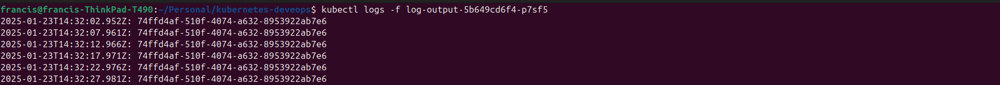

#### List deployments

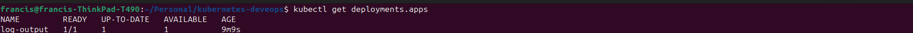

#### List pods

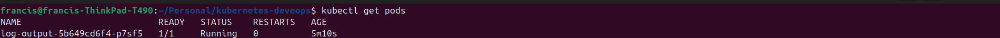

#### Create a deployment for the log output image

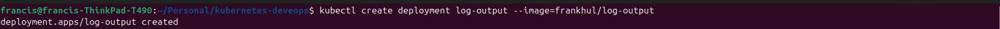

#### Create a cluster using k3d

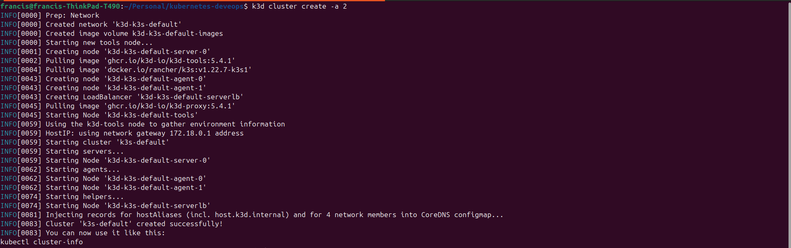

**Exercise 1.02: Project v0.1**

Create a web server that outputs "Server started in port NNNN" when it is started and deploy it into your Kubernetes cluster.

Please make it so that an environment variable PORT can be used to choose that port.

You will not have access to the port when it is running in Kubernetes yet. We will configure the access when we get to networking.

Submission

The Todo App version v0.1 has been published to Docker hub [frankhul/todo-app:v0.1](https://hub.docker.com/layers/frankhul/todo-app/v0.1/images/sha256-25ae5ef44876bd7942370f9c2cf53e8f55dc2774fdd4a94884d4c1755ddab3ff)

#### View logs for the todo-app v0.1 (frankhul/todo-app:v0.1 image)

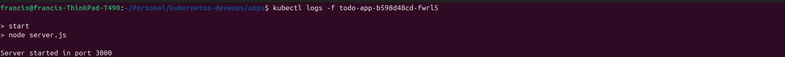

#### List deploymentes

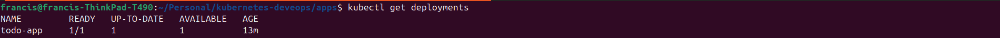

#### List pods

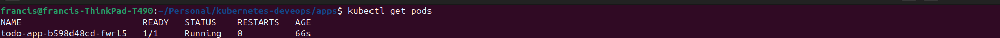

#### Create a deployment for the todo-app v0.1 (frankhul/todo-app:v0.1 image)

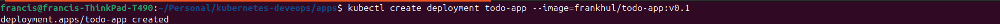

**Exercise 1.03: Declarative approach**

In your "Log output" application create a folder for manifests and move your deployment into a declarative file.

Make sure everything still works by restarting and following logs.

Submission

The deployment declaration file for exercise 1.03 is [Exercise 1.03 Deployment](../apps/log-output/manifests/exercise_1.03/deployment.yml)

#### View logs for the Log Output Application declarative created

#### Declarative Created deployment for the log output application

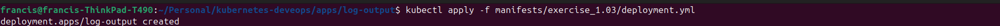

**Exercise 1.04: Project v0.2**

Create a deployment.yaml for the project.

Submission

The deployment declaration file for exercise 1.04 is [Exercise 1.04 Deployment](../apps/todo-app/manifests/exercise_1.04/deployment.yml)

#### View logs for the todo-app v0.1 (frankhul/todo-app:v0.1 image) declarative created

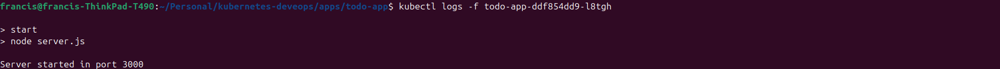

#### Declarative created deployment for the todo-app v0.1 (frankhul/todo-app:v0.1 image)

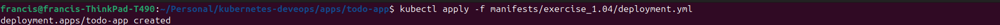

**Exercise 1.05: Project v0.3**

Have the project respond something to a GET request sent to the project. A simple html page is good or you can deploy something more complex like a single-page-application.

Use kubectl port-forward to confirm that the project is accessible and works in the cluster by using a browser to access the project

Submission

The Todo App version v0.3 has been published to Docker hub [frankhul/todo-app:v0.3](https://hub.docker.com/repository/docker/frankhul/todo-app/tags/v0.3/sha256-9e09ee7cbab5b38fbc3d222d4bdfb6b89c49c7fb707db79f903015af75a3cb62)

The deployment declaration file for exercise 1.05 is [Exercise 1.05 Deployment](../apps/todo-app/manifests/exercise_1.05/deployment.yml)

#### Website image

#### View logs for the todo-app v0.3 (frankhul/todo-app:v0.3 image) declarative created

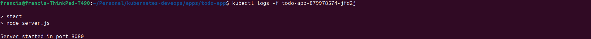

#### Port forwading from 3000 to 8080 the port where the todo-app v0.3 is listening on

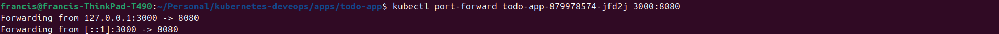

#### Get pod name for the todo-app v0.3

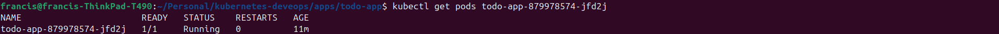

#### Created the deployment for the todo-app v0.3 (frankhul/todo-app:v0.3 image)

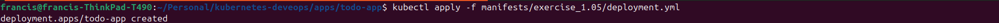

**Exercise 1.06: Project v0.4**

Use a NodePort Service to enable access to the project.

Submission

The service file for exercise 1.06 is [Exercise 1.06 Service](../apps/todo-app/manifests/exercise_1.06/service.yml)

The deployment declaration file for exercise 1.06 is [Exercise 1.06 Deployment](../apps/todo-app/manifests/exercise_1.06/deployment.yml)

The todo app is listening to port **8080**.

Creating the service.

#### The image of visiting the website

**Exercise 1.07: External access with Ingress**

"Log output" application currently outputs a timestamp and a random string to the logs.

Add an endpoint to request the current status (timestamp and string) and an ingress so that you can access it with a browser.

You can just store the string and timestamp to the memory.

Submission:

The service file for exercise 1.07 is [Exercise 1.07 Service](../apps/log-output/manifests/exercise_1.07/service.yml)

The ingress file for exercise 1.07 is [Exercise 1.07 Ingress](../apps/log-output/manifests/exercise_1.07/ingress.yml)

The deployment file for exercise 1.07 is [Exercise 1.07 Deployment](../apps/log-output/manifests/exercise_1.07/deployment.yml)

The new version of the log-output application has been published on Docker hub [frankhul/log-output:v0.2](https://hub.docker.com/repository/docker/frankhul/log-output/tags/v0.2/sha256:0ecf1ecaba4e60c6481a7b7397cd8a5a958f840c1ebdd64aa55199379469aafe)

#### The screenshot showing the return of the timestamp and random string

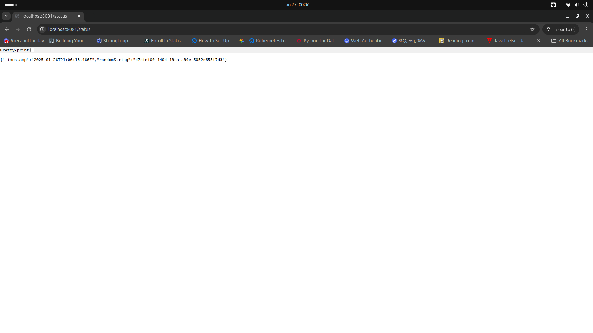

#### The screenshot showing the creation of the service

#### The screenshot showing the creation of the ingress

**Exercise 1.08: Project v0.5**

Switch to using Ingress instead of NodePort to access the project.

You can delete the ingress of the "Log output" application so they don't interfere with this exercise.

We'll look more into paths and routing in the next exercise and at that point you can configure project to run with the "Log output" application side by side.

Submission:

The todo app is listening to port **8080**.

The service file for exercise 1.07 is [Exercise 1.08 Service](../apps/todo-app/manifests/exercise_1.08/service.yml)

The ingress file for exercise 1.07 is [Exercise 1.08 Ingress](../apps/todo-app/manifests/exercise_1.08/ingress.yml)

The deployment file for exercise 1.07 is [Exercise 1.08 Deployment](../apps/todo-app/manifests/exercise_1.08/deployment.yml)

#### The screenshot showing the access of the todo-app website

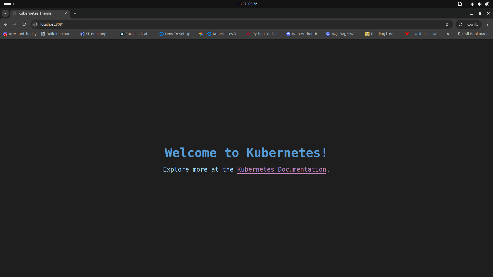

#### The screenshot showing the creation of the service

#### The screenshot showing the creation of the ingress

**Exercise 1.09: More services**

Develop a second application that simply responds with "pong 0" to a GET request and increases a counter (the 0) so that you can see how many requests have been sent. The counter should be in memory so it may reset at some point.

Submission:

The ping pong application is listening on port **4000**

The service file for the ping pong application for exercise 1.09 is [Exercise 1.09 Ping Pong Service](../apps/ping-pong/manifests/exercise_1.09/service.yml)

The ingress file for the ping pong application for exercise 1.09 is [Exercise 1.09 Ping Pong Service](../apps/ping-pong/manifests/exercise_1.09/ingress.yml)

The ping pong image for the exercise 1.09 has been published to docker hub [frankhul/ping-pong:v0.1](https://hub.docker.com/repository/docker/frankhul/ping-pong/tags/v0.1/sha256-c032756d0272cb07a16b20360a2ed6c49f868eea4d9d9a658b3a6409f47540a0)

#### The screenshot showing the access of the ping pong application

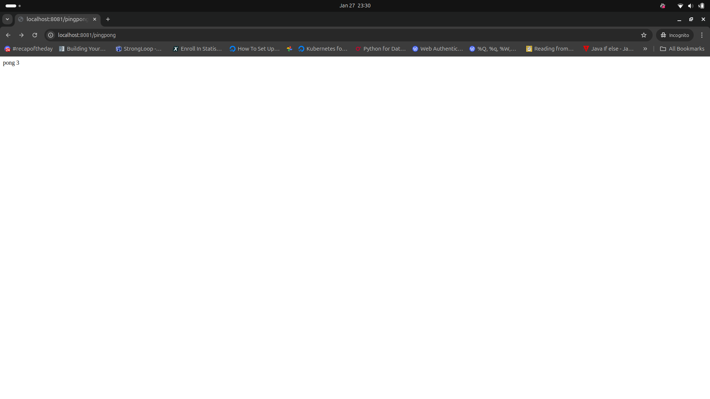

#### The screenshot showing the creation of the service

#### The screenshot showing the creation of the ingress

#### The screenshot showing the access of the logout-put application

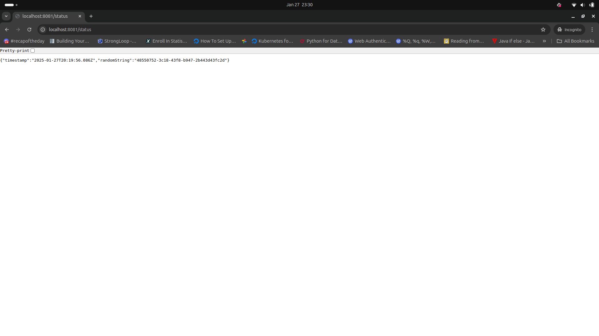

**Exercise 1.10: Even more services**

Split the "Log output" application into two different containers within a single pod:

One generates a new timestamp every 5 seconds and saves it into a file.

The other reads that file and outputs it with a hash for the user to see.

Either application can generate the hash. The reader or the writer.

You may find this helpful now since there are more than one container running inside a pod.

Submission:

The deployment for the split log-output application [Split Logoutput](../apps/log-output-exercise-1.10/manifest/exercise_1.10/deployment.yml)

The log-output reader application is at the following folder [log-output-reader](../apps/log-output-exercise-1.10/reader/)

The image for the log-output reader is published on Docker hub [frankhul/log-output-reader:v0.1](https://hub.docker.com/repository/docker/frankhul/log-output-reader/tags/v0.1/sha256-e59d1a03574aa25ad911eea5650a80f77229f08dfa394dcb74ea58ff57cdc3ee)

The log-output writter application is at the following folder [log-output-writer](../apps/log-output-exercise-1.10/writer/)

The image for the log-output writer is published on Docker hub [frankhul/log-output-writer:v0.1](https://hub.docker.com/repository/docker/frankhul/log-output-writer/tags/v0.1/sha256:0d1a03c816c4508a7db679591c68fcebaa6e6ad7dde05cf1066bed8fac4c3d79)

#### The screenshot showing the creation of the deployment

#### The screenshot showing the logs for the reader log output

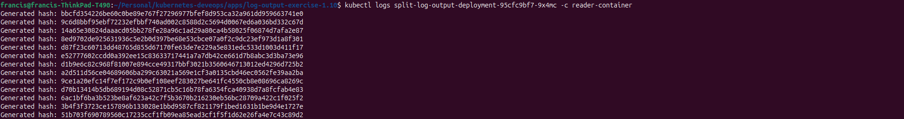

#### The screenshot showing the logs for the writer log output

**Exercise 1.11: Persisting data**

Let's share data between "Ping-pong" and "Log output" applications using persistent volumes. Create both a PersistentVolume and PersistentVolumeClaim and alter the Deployment to utilize it. As PersistentVolumes are often maintained by cluster administrators rather than developers and those are not application specific you should keep the definition for those separated, perhaps in own folder.

Save the number of requests to "Ping-pong" application into a file in the volume and output it with the timestamp and hash when sending a request to our "Log output" application. In the end, the two pods should share a persistent volume between the two applications. So the browser should display the following when accessing the "Log output" application:

2020-03-30T12:15:17.705Z: 8523ecb1-c716-4cb6-a044-b9e83bb98e43.
Ping / Pongs: 3

Submission:

The deployment for this exercise [Deployment](../apps/ping-pong-log-output-data-sharing//manifests/deployment.yaml)

The Persistent Volume defination [Persistent Volume](../apps/ping-pong-log-output-data-sharing/manifests/persistentvolume.yaml)

The Persistent Volume Claim defination [Persistent Volume Claim](../apps/ping-pong-log-output-data-sharing/manifests/persistentvolumeclaim.yaml)

The Ingress defination [Ingress](../apps/ping-pong-log-output-data-sharing/manifests/ingress.yaml)

The log output service (clusterIP type) defination [Log Output Service](../apps/ping-pong-log-output-data-sharing/manifests/service_log_output.yaml)

The ping pong service (clusterIP type) defination [Ping Pong Service](../apps/ping-pong-log-output-data-sharing/manifests/service_ping_pong.yaml)

#### The screenshot for output of the ping pong request

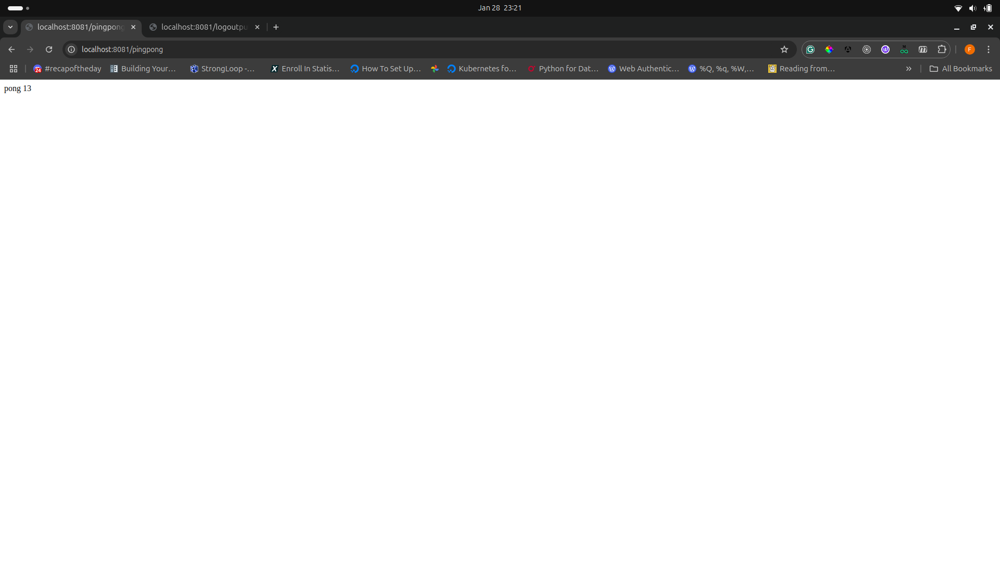

#### The screenshot for the output of the logoutput request

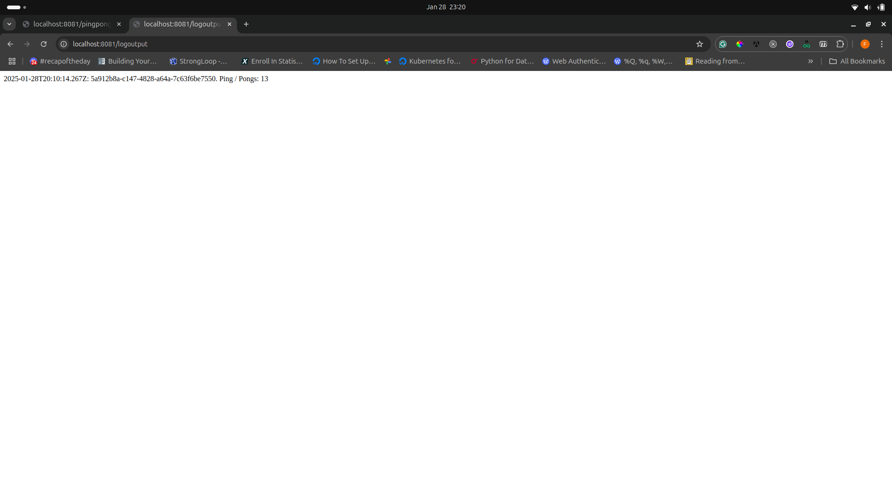

#### Screenshot for the creation of persistent volume

#### Screenshot for the creation of the persistent volume claim

