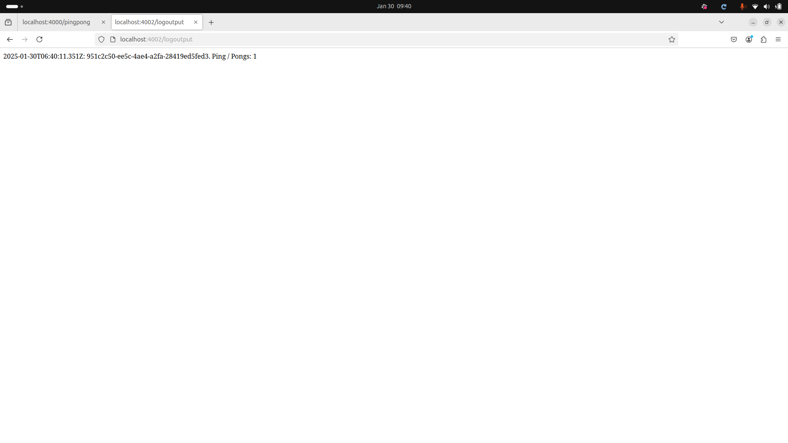
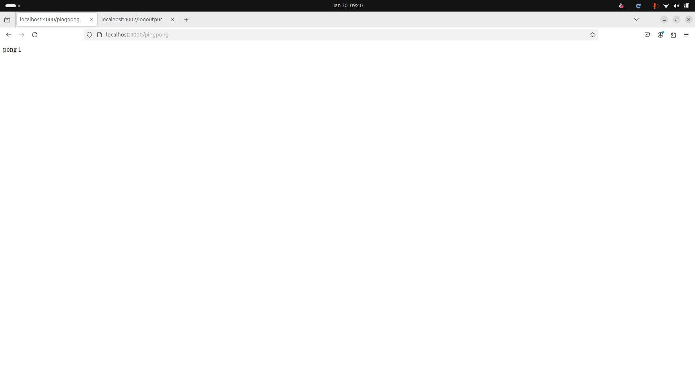
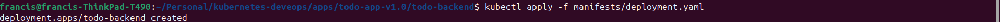
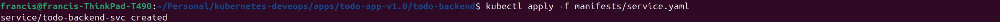
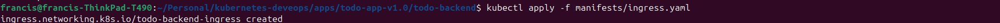
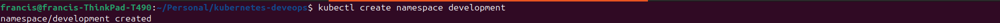
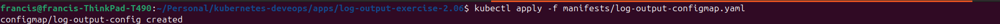
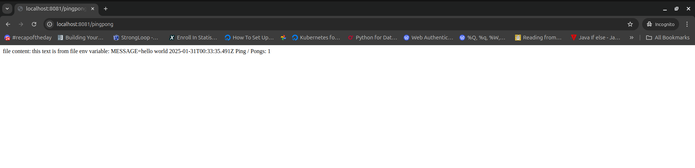
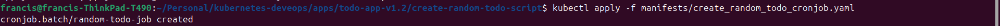
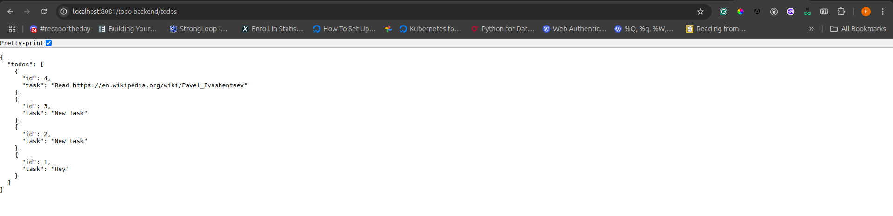

### [Part 2](https://devopswithkubernetes.com/part-2)

**Exercises For Part 2:**

## Exercise 2.01: Connecting pods

Connect the "Log output" application and "Ping-pong" application. Instead of sharing data via files use HTTP endpoints to respond with the number of pongs. Deprecate all the volume between the two applications for the time being.

The output will stay the same:

```
2020-03-30T12:15:17.705Z: 8523ecb1-c716-4cb6-a044-b9e83bb98e43.
Ping / Pongs: 3
```

Submission:

The folder containing the Log Output Application [Log Output Application](../apps/ping-pong-log-output-data-sharing-Exercise%202.01/log-output/)

The folder containing the Ping Pong Application [Ping Pong Application](../apps/ping-pong-log-output-data-sharing-Exercise%202.01/ping-pong/)

The folder containing the kubernetes Log Output Application [Log Output Application Manifest](../apps/ping-pong-log-output-data-sharing-Exercise%202.01/log-output/manifests/)

The folder containing the kubernets Ping Pong Application [Ping Pong Application](../apps/ping-pong-log-output-data-sharing-Exercise%202.01/ping-pong/manifests/)

The image for the Log Output Application has been published to docker hub [frankhul/log-output:v0.3](https://hub.docker.com/repository/docker/frankhul/log-output/tags/v0.3/sha256-fb38e5235394e1c0d9870500e6a37f9b00f3dd7ff43537b8dba327077ff819dd)

The image for the Ping Pong Application has been published to docker hub [frankhul/ping-pong:v0.2](https://hub.docker.com/repository/docker/frankhul/ping-pong/tags/v0.2/sha256-1c060ca6d55bd2add3df198a4a0dfbc90bbc6df40a8b132276b8121165b591cc)

#### Screenshot for the log output application



#### Screenshot for the ping pong application



## Exercise 2.02: Project v1.0

Let us get back to our Project. In the previous part we added a random pic and a form for creating todos to the app. The next step is to create a new container that takes care of saving the todo items.

This new service, let us call it todo-backend, should have a GET /todos endpoint for fetching the list of todos and a POST /todos endpoint for creating a new todo. The todos can be saved into memory, we'll add a database later.

Use ingress routing to enable access to the todo-backend.

The role of the service that we made in previous exercises (Todo-app in the figure) is to serve the HTML and possibly JavaScript to the browser. Also, the logic for serving random pictures and caching those remain in that service.

The new service then takes care of the todo items.

After this exercise, you should be able to create new todos using the form, and the created todos should be rendered in the browser.

Submission:

1. Todo Backend

The todo-backend for this project is found in the following folder [Todo Backend](../apps/todo-app-v1.0/todo-backend/)

The todo-backend image has been published to docker hub [frankhul/todo-backend:v0.1](https://hub.docker.com/repository/docker/frankhul/todo-backend/tags/v0.1/sha256-dd751f2487d44a66265a05ff1b929823c5d5c77c375ee835dc4b22f0d05e28d0)

The deployment for the todo-backend is in the following folder [Todo Backend Deployment](../apps/todo-app-v1.0/todo-backend/manifests/deployment.yaml)

The ClusterIP service for the todo-backend is in the following folder [Todo Backend Service](../apps/todo-app-v1.0/todo-backend/manifests/service.yaml)

The ingress for the todo-backend is in the following folder [Todo Backend Ingress](../apps/todo-app-v1.0/todo-backend/manifests/ingress.yaml)

#### Screenshot for the todo-app access

[Todo Backend Access](2.02/img/2.2_todo_backend_access.png)

#### Screenshot for the created deployment for the todo-backend



#### Screenshot for the created service for the todo-backend



#### Screenshot for the created ingress for the todo-backend



2. Todo Application

The todo applicaton can be found in the following folder [Todo Application](../apps/todo-app-v1.0/todo-app/)

The todo-app image has been published to docker hub [frankhul/todo-app:v0.8](https://hub.docker.com/repository/docker/frankhul/todo-app/tags/v0.8/sha256-d1c66e0b6988eb78f97277e0f779e1b77020e6e8a272b68a2ed25d333d5756ea)

The deployment for the todo-app is in the following folder [Todo App Deployment](../apps/todo-app-v1.0/todo-app/manifests/deployment.yaml)

The ClusterIP service for the todo-app is in the following folder [Todo App Service](../apps/todo-app-v1.0/todo-app/manifests/service.yaml)

The ingress for the todo-app is in the following folder [Todo App Ingress](../apps/todo-app-v1.0/todo-app/manifests/ingress.yaml)

#### Screenshot for the todo-app access

[Todo App Access](2.02/img/2.2_todo_app_access.png)

## Exercise 2.03: Keep them separated

Create a namespace for the applications in the exercises.

Move the "Log output" and "Ping-pong" to that namespace and use that in the future for all of the exercises.

You can follow the material in the default namespace.

Submission

- Created the namespace development. Screenshot for the creation



1. Log output

- The deployment for the log output with namespace can be found [Namespaced deployment](../apps/log-output/manifests/exercise_2.03/deployment.yaml)

- The ingress for the log output with namespace can be found [Namespaced ingress](../apps/log-output/manifests/exercise_2.03/ingress.yaml)

- The service for the log output with namespace can be found [Namespaced Service](../apps/log-output/manifests/exercise_2.03/service.yaml)

2. Ping pong

- - The deployment for the ping pong with namespace can be found [Namespaced deployment](../apps/ping-pong/manifests/exercise_2.03/deployment.yaml)

- The ingress for the ping pong with namespace can be found [Namespaced ingress](../apps/ping-pong/manifests/exercise_2.03/ingress.yaml)

- The service for the ping pong with namespace can be found [Namespaced Service](../apps/ping-pong/manifests/exercise_2.03/service.yaml)

## Exercise 2.04: Project v1.1

Create a namespace for the project and move everything related to the project to that namespace.

Submission

- Created the namespace development. Screenshot for the creation


1. todo-app

- The resource manifests for the todo-app that have been moved to the new namespace development can be found in the following folder
  [Namespaced Todo App Resources](../apps/todo-app-v1.1/todo-app/manifests/)

2. todo-backend

- The resources manifests for the todo-backend that have been moved to the new namespace development can be found in the following folder
  [Namespaced Todo Backend Resources](../apps/todo-app-v1.1/todo-backend/manifests/)

## Exercise 2.06: Documentation and ConfigMaps

Create a ConfigMap for the "Log output" application. The ConfigMap should define one file information.txt and one env variable MESSAGE.

The app should map the file as a volume, and set the environment variable and print the content of those besides the usual output:

```
file content: this text is from file
env variable: MESSAGE=hello world
2024-03-30T12:15:17.705Z: 8523ecb1-c716-4cb6-a044-b9e83bb98e43.
Ping / Pongs: 3
```

Submission:

The log-output for this exercise can be found in the following folder [Log Output(Exercise 2.06)](../apps/log-output-exercise-2.06/)

The configMap for the log-output [ConfigMap Log output](../apps/log-output-exercise-2.06/manifests/log-output-configmap.yaml)

The deployment for the log-output [Deployment Log output](../apps/log-output-exercise-2.06/manifests/deployment.yaml)

The service for the log-output [Service Log output](../apps/log-output-exercise-2.06/manifests/service.yaml)

The ingress for log-output [Ingress Log output](../apps/log-output-exercise-2.06/manifests/ingress.yaml)

#### Screenshot for the creation of the log output configMap



#### Screenshot for the log output output



## Exercise 2.07: Stateful applications

Run a Postgres database and save the Ping-pong application counter into the database.

The Postgres database and Ping-pong application should not be in the same pod. A single Postgres database is enough and it may disappear with the cluster but it should survive even if all pods are taken down.

Hint: it might be a good idea to ensure that the database is operational and available for connections before you try connecting it from the Ping-pong app. For that purpose, you might just start a stand-alone pod that runs a Postgres image:

Submission

The ping pong application can be found in the following folder [Modified Ping Pong](../apps/ping-pong-exercise-2.07/)

The postgres statefulset can be found in the following folder [Postgres Statefulset](../apps/ping-pong-exercise-2.07/manifests/postgres-statefulset.yaml)

- The service, deployment and ingress declaration files can also be found in the manifest folder [Manifest](../apps/ping-pong-exercise-2.07/manifests/)

## Exercise 2.08 Project v1.2

Create a database and save the todos there. Again, the database should have its own pod.

Use Secrets and/or ConfigMaps to have the backend access the database.

Submission

The todo application for this exercise can be found in the following folder [Todo App v1.2](../apps/todo-app-v1.2/)

The todo application backend can be found in the following folder [Todo App v1.2 Todo Backed](../apps/todo-app-v1.2/todo-backend/)

The postgresql statefulset declaration for the todo app can be found here[Todo App V1.2 Postgres Statefulset](../apps/todo-app-v1.2/todo-backend/manifests/postgres-statefulset.yaml)

The postgresql configMap used in the postgresql statefulset can be found in here [Postgresql Statefulset ConfigMap](../apps/todo-app-v1.2/todo-backend/manifests/postgres-configMap.yaml)

The image for the todo-backend has been published to docker hub [frankhul/todo-backend:v0.2](https://hub.docker.com/repository/docker/frankhul/todo-backend/tags/v0.2/sha256:5b5f9a3ee2ee5da4d5ed0ea4e7180b266a571d04f7a43d78b2c35f938902e0f3)

The image for the todo-app has been published to docker hub [frankhul/todo-app:v0.9](https://hub.docker.com/repository/docker/frankhul/todo-app/tags/v0.9/sha256:6c6999fb12e2d837b07bd1db41f16a8ab5bc88cd3cac0225d6b3bd3a75ab5d0a)

## Exercise 2.09: Daily todos

Create a CronJob that generates a new todo every hour to remind you to do 'Read < URL >'.

Where < URL > is a Wikipedia article that was decided by the job randomly. It does not have to be a hyperlink, the user can copy-paste the URL from the todo.

https://en.wikipedia.org/wiki/Special:Random responds with a redirect to a random Wikipedia page so you can ask it to provide a random article for you to read. TIP: Check location header

Submission

The cronjob declaration file can be found here [Random Todo Cronjob](../apps/todo-app-v1.2/create-random-todo-script/manifests/create_random_todo_cronjob.yaml)

The script for randomly create a todo can be found here [Random Create Todo](../apps/todo-app-v1.2/create-random-todo-script/index.js)

The image for the script that randomly create task has been published to docker hub [frankhul/create-todo-script:v0.1](https://hub.docker.com/repository/docker/frankhul/create-todo-script/tags/v0.1/sha256-e61afd88a8a31675c04eb06255aed2a664efa0915555c6ccd1f3d9e15cd0c4bf)

#### The screenshot for the creation of the cronjob



#### The screenshot showing the added random todo



## Exercise 2.10: Project v1.3

The project could really use logging.

Add request logging so that you can monitor every todo that is sent to the backend.

Set the limit of 140 characters for todos into the backend as well. Use Postman or curl to test that too long todos are blocked by the backend and you can see the non-allowed messages in your Grafana.

Submission:

The folder where the updated todo-app can be found in the following folder [Todo App V1.3](../apps/todo-app-v1.3/)

The folder where the todo-backend with the loging and character limitation can be found in the following [Todo App V1.3 Backend](../apps/todo-app-v1.3/todo-backend/)

The updated image of the todo-backend has been published to docker [frankhul/todo-backend:v0.3](https://hub.docker.com/repository/docker/frankhul/todo-backend/tags/v0.3/sha256-bc2a326b22db68394afda9c3d69d5d53bd68809b1822a7be96c59fc7d9fd64a8)

#### Screenshot of prometheus logs on the todo backend

[Prometheus Screenshot With Todo Backend Logs](2.10/img/2.10_prometheus_catching_tod_backend_logs.png)

#### Screenshot of the submission of long todo in postman

[Postman Screenshot with long todo](2.10/img/2.10_postman_submittion_long_todo.png)
