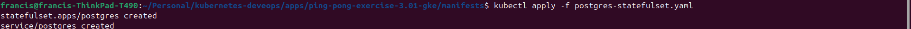

### [Part 2](https://devopswithkubernetes.com/part-3)

**Exercises For Part 2:**

**Exercise 3.01: Pingpong GKE**

Deploy Ping-pong application into GKE.

In this exercise use a LoadBalancer service to expose the service.

Submission

The ping pong application for this exercise is found in the following folder [Ping Pong GKE](../apps/ping-pong-exercise-3.01-gke/)

The service.yaml, postgres-statefulset.yaml, deployment.yaml and postgres-configmap can be found in the following folder
[Ping Pong GKE manifest](../apps/ping-pong-exercise-3.01-gke//manifests/)

#### Screenshot of the view of the application of in browser

#### Screenshot of the creation of the postgres statefulset

#### Logs for successful creation of the postgres statefulset

#### Screenshot of the allocated external ip address of the service(loadbalancer)

**Exercise 3.02: Back to Ingress**

Deploy the "Log output" and "Ping-pong" applications into GKE and expose it with Ingress.

"Ping-pong" will have to respond from /pingpong path. This may require you to rewrite parts of the code.

Note that Ingress expects a service to give a successful response in the path / even if the service is mapped to some other path!

Submission

The log output applications used to tackle this exercise can be found in the following folder [Ping Pong and Logoutp](../apps/ping-pong-log-output-data-sharing-Exercise-3.02/log-output/)

The ping pong applications used to tackle this exercise can be found in the following folder [Ping Pong and Logoutp](../apps/ping-pong-log-output-data-sharing-Exercise-3.02/ping-pong/)

I have used one ingress declaration file [Ingress Declaration](../apps/ping-pong-log-output-data-sharing-Exercise-3.02/manifest/ingress.yaml)

The log-output service declaration can be found at [Logoutput Service](../apps/ping-pong-log-output-data-sharing-Exercise-3.02/log-output/manifests/service.yaml)

The ping-pong service declaration can be found at [Ping Pong Service](../apps/ping-pong-log-output-data-sharing-Exercise-3.02/ping-pong/manifests/service.yaml)

#### The NodePort service listing for the log-output and ping-pong

#### The Ingress listing that redirect to log-output if / and ping-pong if /pingpong

**Exercise 3.06: DBaaS vs DIY**

Do a pros/cons comparison of the solutions in terms of meaningful differences. This includes at least the required work and costs to initialize as well as the maintenance. Backup methods and their ease of usage should be considered as well.

Write your answer in the README of the project.

Submission:

# DBaaS (Google Cloud SQL) vs DIY (PersistentVolumes + Postgres)

## 1. Required Work and Initialization

- **DBaaS (Google Cloud SQL)**:

  - **Pros**:
    - Easy setup using Google Cloud Console or APIs, with a fully managed Postgres instance.
    - No need to worry about provisioning, scaling, or configuring databases; pre-configured for availability and performance.
  - **Cons**:
    - Limited customization of database settings.
    - Vendor lock-in, which can make migration away from Google Cloud challenging.

- **DIY (PersistentVolumes + Postgres)**:
  - **Pros**:
    - Full control over Postgres configuration, allowing for customization and optimization.
    - Easier to integrate into a multi-cloud or hybrid-cloud strategy since you manage the Postgres instance.
  - **Cons**:
    - Requires manual setup of PersistentVolumes, PersistentVolumeClaims, and Postgres in Kubernetes.
    - More complex setup involving YAML configurations and Kubernetes resources.

## 2. Costs

- **DBaaS (Google Cloud SQL)**:

  - **Pros**:
    - Transparent, pay-as-you-go pricing model, with costs covering maintenance tasks such as patching and backups.
  - **Cons**:
    - Generally more expensive due to the fully managed service.
    - Additional costs for backups, high availability, or network configurations.

- **DIY (PersistentVolumes + Postgres)**:
  - **Pros**:
    - Potentially cheaper, especially if you have existing Kubernetes cluster resources.
  - **Cons**:
    - Less predictable costs due to factors like resource scaling, redundancy, and additional infrastructure.
    - Additional labor costs for management and maintenance.

## 3. Maintenance

- **DBaaS (Google Cloud SQL)**:

  - **Pros**:
    - Automated patching, upgrades, and security management by Google.
    - Built-in scaling, failover, and high availability options.
  - **Cons**:
    - Limited control over maintenance scheduling.
    - Less flexibility in terms of database versions and update timing.

- **DIY (PersistentVolumes + Postgres)**:
  - **Pros**:
    - Full control over maintenance tasks such as patching, upgrades, and version management.
    - Ability to implement custom workflows and schedules.
  - **Cons**:
    - Requires manual management of scaling, security updates, and failover.
    - Higher maintenance overhead to ensure database performance and health.

## 4. Backups

- **DBaaS (Google Cloud SQL)**:

  - **Pros**:
    - Automated backups with point-in-time recovery.
    - Managed disaster recovery features with easy failover and high availability options.
  - **Cons**:
    - Limited control over backup scheduling and retention policies.
    - Restore processes can take time and are subject to Google's automated workflow.

- **DIY (PersistentVolumes + Postgres)**:
  - **Pros**:
    - Full control over backup strategies, including scheduling and retention.
    - Can use custom tools (e.g., pgBackRest) for automation and enhanced backup workflows.
  - **Cons**:
    - More complexity in managing reliable backups, requiring additional resources for disaster recovery.
    - Backups must be regularly tested and manually handled.
